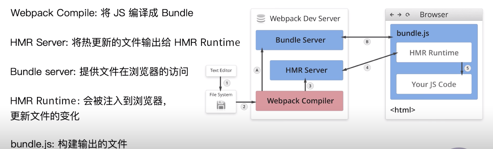

<!--
 * @Author: your name
 * @Date: 2020-03-16 21:38:15
 * @LastEditTime: 2020-03-18 16:56:20
 * @LastEditors: Please set LastEditors
 * @Description: In User Settings Edit
 * @FilePath: /webpack/02_demo/README.md
 -->
## webpack基本用法

### webpack中的文件监听
+ 文件监听是在发现源码发生变化时，自动重新构建新的输出文件
+ webpack开启监听模式，有两种
  - 1.启动webpack命令，带上--watch参数。
    + 缺点：需要每次手动刷新浏览器
  ```package.json
    "scripts": {
        "build": "webpack",
        "watch": "webpack --watch"
    },
  ```  
  - 2.在配置webpack.config.js中配置watch:true
    + 原理：轮训判断文件最后编辑时间是否变化
  ```js
    // webpack.config.js
    module.exports = {
        // 默认false,就是不开启
        watch: true,
        // 只有开启监听模式，watchOptions才有意义
        watchOptions:{
            // 默认为空，不监听的文件或者文件夹，支持正则匹配
            ignored: /node_modules/,
            // 监听到变化发生后会等300ms再去执行，默认300ms
            aggregateTimeout:300,
            // 判断文件是否发生变化是通过不停询问系统指定文件有么有变化实现，默认1000ms
            poll:1000
        }
    }
  ```

### webpack-dev-server热更新
+ 安装webpack-dev-server
  ```
    npm i webpack-dev-server -D
  ```
+ 在package.json中配置npm scripts
    - --open是自动打开浏览器
  ```   
    "scripts": {
        "dev": "webpack-dev-server --open"
    },
  ```

+ 在webpack.config.js中配置webpack-dev-server的plugin
  ```js
    const webpack = require('webpack');
    module.exports = {
        // 以上省略
        plugins:[
            new webpack.HotModuleReplacementPlugin()
        ],
        devServer:{
            contentBase:'./dist',
            hot: true
        }
    }
  ```
+ 运行：npm run dev。自动打开浏览器。
+ 修改代码，保存，浏览器自动刷新。

### 热更新原理分析

#### 从右图看，分两步，一步是启动阶段，第二步是热更新阶段
+ 1.启动阶段 1 -> 2 -> A -> B
  - 文件经webpack compile将js编译打包bundle.js
  - 利用Bundle server 可以直接提供在线访问，就是localhost:8080/index.html
+ 2.热更新阶段
  - 当修改文件后，也经过webpack complie将js编译打包成bundle.js
  - 利用HMR Server 将热更新的文件输出给HMR Runtime
  - HMR Runtime 将bundle.js注入到浏览器，更新文件的变化。
  
+ 热更新有最核心的是 HMR Server 和 HMR runtime。
+ HMR Server 是服务端，用来将变化的 js 模块通过 websocket 的消息通知给浏览器端。
+ HMR Runtime是浏览器端，用于接受 HMR Server 传递的模块数据，浏览器端可以看到 .hot-update.json 的文件过来。

#### HotModuleReplacementPlugin
+ webpack 构建出来的 bundle.js 本身是不具备热更新的能力的，HotModuleReplacementPlugin 的作用就是将 HMR runtime 注入到 bundle.js，使得bundle.js可以和HMR server建立websocket的通信连接

#### webpack-dev-server和hot-module-replacement-plugin之间的关系。
+ webpack-dev-server(WDS)的功能提供 bundle server的能力，就是生成的 bundle.js 文件可以通过 localhost://xxx 的方式去访问，另外 WDS 也提供 livereload(浏览器的自动刷新)。
+ hot-module-replacement-plugin 的作用是提供 HMR 的 runtime，并且将 runtime 注入到 bundle.js 代码里面去。一旦磁盘里面的文件修改，那么 HMR server 会将有修改的 js module 信息发送给 HMR runtime，然后 HMR runtime 去局部更新页面的代码。因此这种方式可以不用刷新浏览器。
+ 简单来说就是：hot-module-replacement-plugin 包给 webpack-dev-server 提供了热更新的能力。

#### 另一种热更新：webpack-dev-middleware
+ 将webpack输出的文件传输给服务器.


### 文件指纹
+ Hash:和整个项目的构建相关，只要项目文件有修改，整个项目构建的hash值就会更改
+ Chunkhash:和webpack打包的chunk有关，不同的entry会生成不同的chunkhash值
+ Contenthash:根据文件内容来定义hash,文件内容不变，则contenthash不变


#### js的文件指纹设置
+ 设置output的filename.使用[chunkhash]
```js
    // webpack.config.js
    module.exports = {
        entry:{
            app:'./src/app.js',
            search:'./src/search.js',
        },
        output:{
            path:__dirname+"/dist",
            filename:'[name][chunkhash:8].js'
        }
    }
```

#### css的文件指纹设置
+ 设置MiniCssExtractPlugin的filename，使用[contenthash]
+ MiniCssExtractPlugin将css从js中抽离出来单独的css文件
+ 安装MiniCssExtractPlugin
+ MiniCssExtractPlugin.loader 和style-loader是互斥的，不能共用

```
    npm i mini-css-extract-plugin -D
```

```js
    // webpack.config.js
    module.exports = {
        entry:{
            app:'./src/app.js',
           search:'./src/search.js',
            
        },
        output:{
            path:__dirname+"/dist",
            filename:'[name][chunkhash:8].js'
        },
        module:{
            rules:[{
                test:/\.css/,
                use:[
                    MiniCssExtractPlugin.loader,
                    'css-loader'
                ]
            }]
        },
        plugins:[
            new MiniCssExtractPlugin({
                filename:'[name][contenthash:8].css'
            })
        ]
    }
```

#### 图片的文件指纹设置
+ 设置file-loader的name,使用[hash]
|  占位符名称   | 含义  |
|  ----  | ----  |
| [ext]  | 资源后缀名 |
| [name]  | 文件名称 |
| [path]  | 文件的相对路径 |
| [folder]  | 文件所在的文件夹 |
| [contenthash]  | 文件的内容hash,默认是md5生成 |
| [hash]  | 文件的内容hash,默认是md5生成 |
| [emoji]  | 一个随机的指代文件内容的emoj |

```js
    // webpack.config.js
    module.exports = {
        entry:{
            app:'./src/app.js',
           search:'./src/search.js',
            
        },
        output:{
            path:__dirname+"/dist",
            filename:'[name][chunkhash:8].js'
        },
        module:{
            rules:[{
                test:/\.(png|jpg|jpeg|gif)$/,
                use:[{
                    loader:'file-loader',
                    options:{
                        name:'img/[name][hash:8].[ext]'
                    }
                }]
            }]
        }
    }
```

#### bundle，chunk和module。

+ bundle：打包最终生成的文件
+ chunk：每个chunk是由多个module组成，可以通过代码分割成多个chunk。
+ module：webpack中的模块（js、css、图片等等）


### 代码压缩
+ html压缩
+ css 压缩
+ js压缩

#### js压缩
+ 内置了uglifyjs-webpack-plugin

#### css文件压缩
+ 使用optimize-css-assets-webpack-plugin,同时使用cssnano(预处理器)
+ 安装
```
    npm i optimize-css-assets-webpack-plugin cssnano -D
```

```js
    // webpack.config.js
    module.exports = {
        entry:{
            app:'./src/app.js',
           search:'./src/search.js',
            
        },
        output:{
            path:__dirname+"/dist",
            filename:'[name][chunkhash:8].js'
        },
       plugins:[
           new OptimizeCSSAssetsPlugin({
               assetNameRegExp:/\.css$/g,
               cssProcessor:require('cssnano')
           })
       ]
    }
```

#### html文件压缩
+ 设置html-webpack-plugin,设置压缩参数
+ 安装
```
    npm i html-webpack-plugin -D
```

```js
// webpack.config.js
    module.exports = {
        entry:{
            app:'./src/app.js',
           search:'./src/search.js',
            
        },
        output:{
            path:__dirname+"/dist",
            filename:'[name][chunkhash:8].js'
        },
       plugins:[
           new HtmlWebpackPlugin({
               template:path.join(__dirname,'src/search.html'),
               filename:'search.html',
               chunks:['search'],
               inject:true,
               minify:{
                   html5:true,
                   collapseWhitespace:true,
                   preserveLineBreaks:false,
                   minifyCss:true,
                   minifyJs:true,
                   removeComments:false
               }
           })
       ]
    }
```
