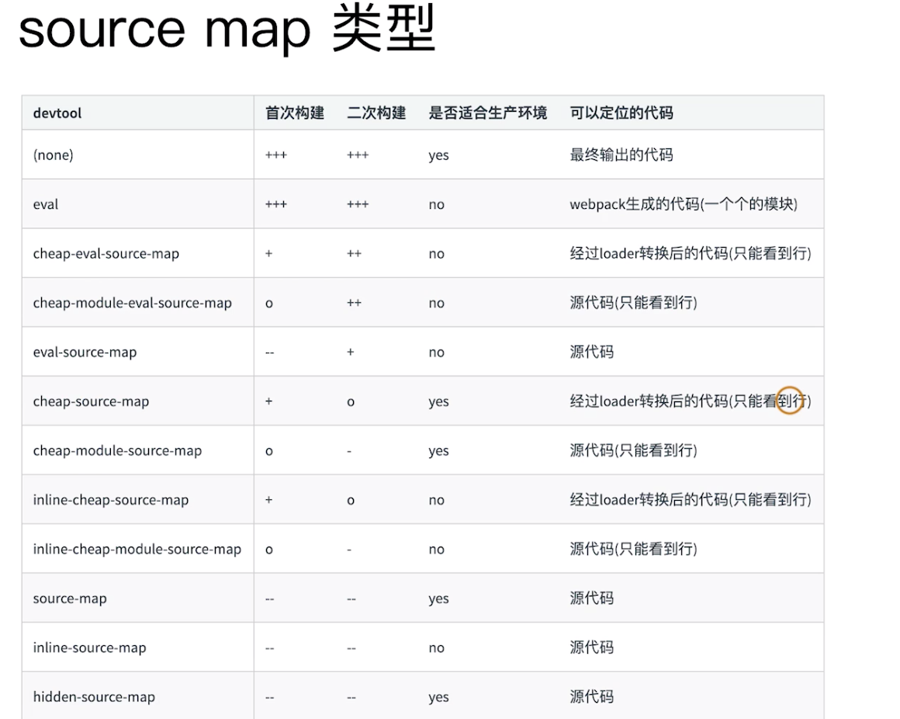

<!--
 * @Author: your name
 * @Date: 2020-03-16 21:38:15
 * @LastEditTime: 2020-03-20 15:38:39
 * @LastEditors: Please set LastEditors
 * @Description: In User Settings Edit
 * @FilePath: /webpack/02_demo/README.md
 -->
### 多页面打包通用方案
+ 动态获取entry 和 设置 html-webpack-plugin
+ 利用 glob.sync
```js
    entry: glob.sync(path.join(__dirname,'./src/*/index.js'))
```

+ 安装glob库
```
     npm i glob -D
```
+ 源码目录需要按照下面规则
  - 在src目录下创建各自的文件夹，如search文件夹，在search文件夹中，创建index.html和index.js。其他一样。
  
+ 使用: 动态获取entry和htmlWebpackPlugin
```js
    const setMPA = () => {
        const entry = {};
        const HtmlWebpackPlugins = [];

        // 匹配到每个模块的文件夹
        const entryFiles = glob.sync(path.join(__dirname,'./src/*/index.js')) 
        Object.keys(entryFiles).map(index => {
            const entryFile = entryFiles[index]; // 获取每个js文件的路径
            const match  = entryFile.match(/src\/(.*)\/index\.js/);
            const pageName = match && match[1] 
            entry[pageName] =entryFile;
            HtmlWebpackPlugins.push(
                new HtmlWebpackPlugin({
                    template:path.join(__dirname,`src/${pageName}/index.html`),
                    filename:`${pageName}.html`,
                    chunks:[pageName],
                    inject:true,
                    minify:{
                        html5:true,
                        collapseWhitespace:true,
                        preserveLineBreaks:false,
                        minifyCss:true,
                        minifyJs:true,
                        removeComments:false
                    }
                })
            )
        })
        return {
            entry,
            HtmlWebpackPlugins
        }
    }
    const {entry,HtmlWebpackPlugins} = setMPA()
    module.exports = {
        entry:entry,
        // ...
        plugins:[...HtmlWebpackPlugins]
    }
```


### source-map
+ 作用：通过source map定位到源代码
+ 开发环境开启，线上环境关闭。
  - 线上排查问题的适合可以将source map上传到错误监控系统

+ source map 关键字
  - eval:使用eval包裹模块代码
  - source map:产生.map文件
  - cheap: 不包含列信息
  - inline: 将.map作为DataURI嵌入，不单独生成.map文件
  - module:包含loader的sourcemap


+ 使用
```js
    module.exports = {
        // ... 
        devServer:{
            contentBase:'./dist',
            hot: true
        },
        devtool:'source-map'
    }
```

+ 运行即可生成.map文件