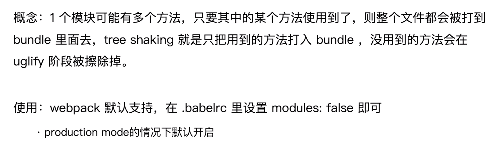
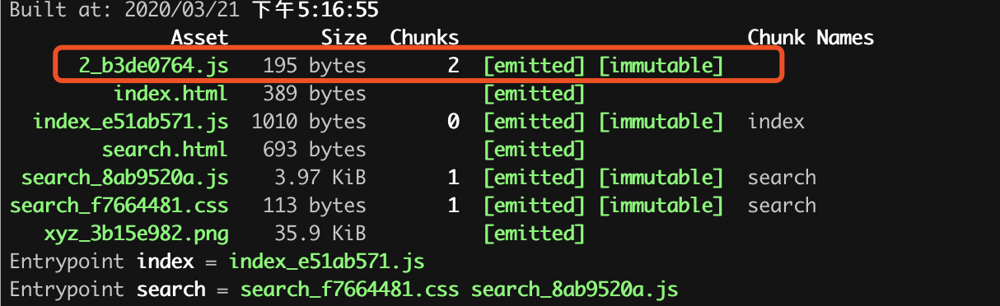

<!--
 * @Author: your name
 * @Date: 2020-03-16 21:38:15
 * @LastEditTime: 2020-03-21 17:22:17
 * @LastEditors: Please set LastEditors
 * @Description: In User Settings Edit
 * @FilePath: /webpack/02_demo/README.md
 -->
### 提取页面公共资源

#### 第一种：使用html-webpack-externals-plugin
+ 安装
```
    npm i html-webpack-externals-plugin -D
```

+ 在react中一般把react react-dom提取出来放到cdn上

+ 使用
```js
    // webpack.config.js
    const HtmlWebpackExternalsPlugin = require('html-webpack-externals-plugin')
    module.exports = {
        plugins:[
            new HtmlWebpackExternalsPlugin({
                externals: [
                {
                    module: 'react',
                    entry: 'https://11.url.cn/now/lib/16.2.0/react.min.js',
                    global: 'React',
                },
                {
                    module: 'react-dom',
                    entry: 'https://11.url.cn/now/lib/16.2.0/react-dom.min.js',
                    global: 'ReactDOM',
                },
                ]
            })
        ]
    }
```

+ 在html文件里面引入react react-dom
```html
   <script src="https://11.url.cn/now/lib/16.2.0/react.min.js"></script>
    <script src="https://11.url.cn/now/lib/16.2.0/react-dom.min.js"></script>
```

+ 打包即可把react和react-dom提取出来

#### 第二种：SplitChunksPlugin
+ webpack4内置的，替代CommonsChunkPlugin
+ chunks参数说明
  - async:异步引入的库进行分离（默认）
  - initial:同步引入的库进行分离
  - all:所有引入的库进行分离（推荐）

+ 使用
```js
    // webpack.config.js
    module.exports = {
         chunks:['vendors',pageName], // 在htmlWebpackPlugin中新加'vendors'
        // ...
         optimization: {
            splitChunks: {
                minSize: 0, // 最小是0字节的时才打公共包
                cacheGroups: {
                    commons: {
                        test: /(react|react-dom)/,
                        name:'vendors',
                        chunks: 'all',
                        minChunks: 2, // 最小有2个文件引入公共文件才打公共包
                    }
                }
            }
        },
    }
```

### tree shaking(摇树优化)
+ 要求：必须是ES6语法,cjs的方式不支持


+ DCE
  - 代码不会被执行，不可到达
  - 代码执行的结果不会被用到
  - 代码只会影响死变量（只写不读）

#### tree-shaking原理
+ 利用es6模块特点：
  - 只能作为模块顶层的语句出现
  - import 的模块名只能是字符串常量
  - import binding是immitable的
+ 代码擦除：uglify阶段删除无用代码

#### 使用
+ 定义一个tree-shaking.js
```js
    export function a(){
        return 'this is page a'
    }

    export function b(){
        return 'this is page b'
    }
```
+ 在search/index.js中引入函数a，并且使用函数a
+ 打包后文件中只有函数a，而没有函数b。从而达到优化无用代码效果


### 代码分割和动态import
#### 动态分割意义
+ 将代码库分割成chunks,当代码运行到需要它们的时候再进行加载
+ 适用场景：
  - 抽离相同代码到一个共享块
  - 脚本懒加载，使得初始化下载的代码更小

#### 懒加载js的方式
+ cjs:require.ensure
+ es6:动态import(需要babel转换)

#### 如何使用动态import
+ 安装babel插件
```
    npm i @babel/plugin-syntax-dynamic-import -D
```
+ 在.babelrc中加入babel插件
```
    {
        "plugins":["@babel/plugin-syntax-dynamic-import"]
    }
```

#### 使用
+ 在search中创建text.js
```js
    import React from 'react';

    export default () => <div>动态 import </div>
```

+ 在search/index.js中动态引入text.js，在图片点击时才加载text.js
+ 打包后，查看效果
