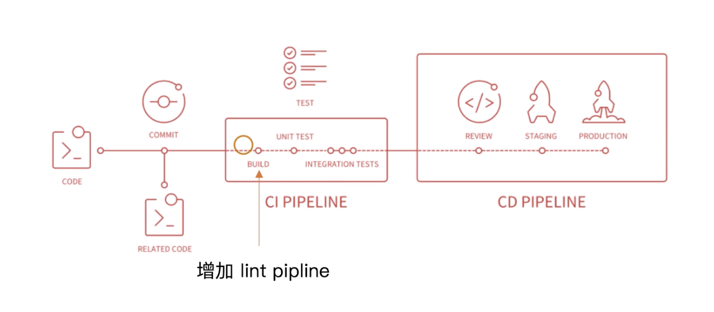
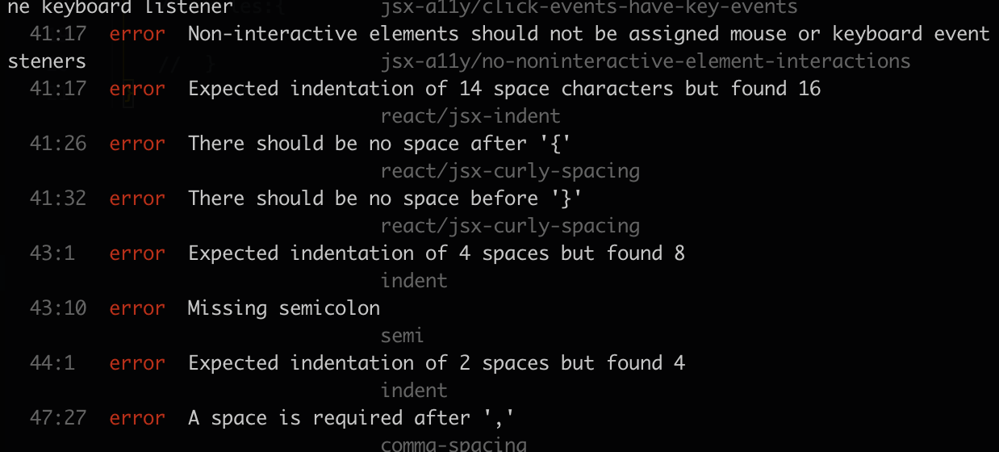

<!--
 * @Author: your name
 * @Date: 2020-03-16 21:38:15
 * @LastEditTime: 2020-03-22 15:42:54
 * @LastEditors: Please set LastEditors
 * @Description: In User Settings Edit
 * @FilePath: /webpack/02_demo/README.md
 -->
### 在webpack中使用eslint
#### eslint如何执行落地
##### 和CI/CD系统集成


+ 本地开发阶段增加precommit钩子
  - 安装 husky
  ```
    npm i husky -D
  ```
  - 增加 npm script，通过lint-staged增量检查修改的文件
  ```
    "scripts":{
        "precommit":"lint-staged"
    },
    "lint-staged":{
        "linters:{
            "*.{js,css}":["eslint --fix","git add"]
        }
    }
  ```
##### 和webpack集成
+ 使用eslint-loader,构建时检查js规范
```js
    // webpack.config.js
    module.exports = {
        module:{
            rules:[
                {
                    test:/\.js$/,
                    exclude:/node_modules/,
                    use:[
                        "babel-loader",
                        "eslint-loader"
                    ]
                }
            ]
        }
    }
```

#### 使用eslint-loader
+ 安装依赖包
```
    npm i eslint eslint-plugin-import eslint-plugin-react eslint-plugin-jsx-a11y eslint-loader babel-eslint eslint-config-airbnb -D
```

+ 在webpack中增加eslint-loader
```js
    // webpack.config.js
    module.exports = {
        module:{
            rules:[
                {
                    test:/\.js$/,
                    exclude:/node_modules/,
                    use:[
                        "babel-loader",
                        "eslint-loader"
                    ]
                }
            ]
        }
    }
```

+ 在根目录创建.eslintrc.js
```js
     module.exports = {
        "parse":"babel-eslint",
        "extends":"airbnb",
        "env":{
            "browser":true,
            "node":true
        }
        // 自定义规则
        //  rules:{

        //  }
    }
```

+ 打包构建在命令后就可以看到eslint提示的代码错误



### webpack打包组件和基础库
#### 实现一个大整数加法库的打包
+ 需要打包压缩版和非压缩版本
+ 支持AMD/CJS/ESM模块引入

#### 打包输出库的名称
+ 未压缩版 large-number.js
+ 压缩版 large-number.min.js

#### 如何将库暴露出去
+ library: 指定库的全局变量
+ libraryTarget: 支持库引入的方式

#### 开始
+ 创建新项目文件夹large-number
+ 初始化项目 npm init -y
+ 安装webpack
```
    npm i webpack webpack-cli -D
```
+ 创建webpack.config.js
  - 安装terser-webpack-plugin
  ```
    npm i terser-webpack-plugin -D
  ```
```js
    const TerserPlugin = require('terser-webpack-plugin');

    module.exports = {
        entry:{
            "large-number":"./src/index.js",
            "large-number.min":"./src/index.js",
        },
        output:{
            filename:'[name].js',
            library: 'largeNumber',
            libraryTarget:"umd",
            libraryExport:'default'
        },
        mode: 'none',
        optimization: {
            minimize: true,
            minimizer: [
                new TerserPlugin({
                    include: /\.min\.js$/,
                })
            ]
        }
    }
```

+ 创建src/index.js
```js
    export default function add(a, b) {
        let i = a.length - 1;
        let j = b.length - 1;

        let carry = 0;
        let ret = '';
        while (i >= 0 || j >= 0) {
            let x = 0;
            let y = 0;
            let sum;

            if (i >= 0) {
                x = a[i] - '0';
                i --;
            }

            if (j >= 0) {
                y = b[j] - '0';
                j --;
            }

            sum = x + y + carry;

            if (sum >= 10) {
                carry = 1;
                sum -= 10;
            } else {
                carry = 0;
            }
            // 0 + ''
            ret = sum + ret;
        }

        if (carry) {
            ret = carry + ret;
        }

        return ret;
    }
```

+ 在根目录创建index.js
```js
    // 区分生产环境 和测试环境
    if (process.env.NODE_ENV === 'production') {
        module.exports = require('./dist/large-number.min.js');
    } else {
        module.exports = require('./dist/large-number.js');
    }
```

+ 增加npm scripts
```
     "scripts": {
        "build": "webpack",
        "prepublish": "webpack"
    },
```

+ 打包 npm run build


+ 发布npm包
  - npm login
  - npm publish

+ 在其他项目中使用large-count包
  - 安装large-count包
  ```
   npm i large-count -S
  ```
  - 在search/index.js中使用
  ```js
    import largeCount from 'large-count';

    render(){
        const largeRes = largeCount('99','1')
        return (
            <div>
                { largeRes }
            </div>
        )
    }
  ```
  - 打包 npm run build 即可正常看到结果
  