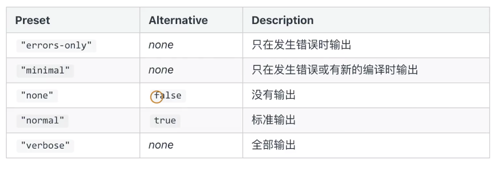

<!--
 * @Author: your name
 * @Date: 2020-03-16 21:38:15
 * @LastEditTime: 2020-03-22 17:38:53
 * @LastEditors: Please set LastEditors
 * @Description: In User Settings Edit
 * @FilePath: /webpack/02_demo/README.md
 -->
### webpack 实现SSR打包
+ 创建webpack.ssr.js
```js

```

+ 增加ssr npm scripts
```
    "build:ssr": "webpack --config webpack.ssr.js"
```

+ 在根目录创建server/index.js
```js
    if (typeof window === 'undefined') {
        global.window = {};
    }

    const express = require('express');
    const { renderToString } = require('react-dom/server');
    const SSR = require('../dist/search-server');

    const server = (port) => {
        const app = express();

        app.use(express.static('dist'));
        app.get('/search', (req, res) => {
            const html = renderMarkup(renderToString(SSR));
            res.status(200).send(html);
        });

        app.listen(port, () => {
            console.log('Server is running on port:' + port);
        });
    };

    server(process.env.PORT || 3000);

    const renderMarkup = (str) => {
        return `
        <!DOCTYPE html>
        <html lang="en">
        <head>
            <meta charset="UTF-8">
            <meta name="viewport" content="width=device-width, initial-scale=1.0">
            <title>Document</title>
        </head>
        <body>
            <div>${str}</div>
        </body>
        </html>
        `
    }
```

+ 在src/search/中创建 index-server.js
```js
    const React = require('react');
    const largeCount = require('large-count');
    const logo = require('./images/xyz.png');
    require('./search.less');


    class Search extends React.Component{

        constructor(){
            super(...arguments);
            this.state = {
                Text:null
            }
        }
        handleClick() {
            import('./text').then(text=> {
                this.setState({
                    Text:text
                })
            })
        }
        render(){
            const { Text } = this.state;
            const addResult = largeCount('99','1')
            return (
                <div className="search">
                    {
                        Text ? <Text /> : null
                    }
                    {addResult}
                    
                </div>
            )
        }
    }

    module.exports = <Search />;
```

+ 修改webpack.ssr.js
```js
    // 修改入口文件 index-server.js
    const entryFiles = glob.sync(path.join(__dirname,'./src/*/index-server.js'))
    // 修改匹配到的文件
    const match  = entryFile.match(/src\/(.*)\/index-server\.js/);

    // 增加判断： 只有设置的才ssr打包
    if(pageName){
            entry[pageName] =entryFile;
            HtmlWebpackPlugins.push(
                new HtmlWebpackPlugin({
                    template:path.join(__dirname,`src/${pageName}/index.html`),
                    filename:`${pageName}.html`,
                    chunks:['vendors',pageName],
                    inject:true,
                    minify:{
                        html5:true,
                        collapseWhitespace:true,
                        preserveLineBreaks:false,
                        minifyCss:true,
                        minifyJs:true,
                        removeComments:false
                    }
                })
            )
    }

    // 修改出口文件
    output: {
        path: path.join(__dirname, 'dist'),
        filename: '[name]-server.js',
        libraryTarget: 'umd'
    },
```

+ ssr 打包
```
    npm run build:ssr
```

+ 开启node服务
```
    node server/index.js
```

### 优化构建时命令后的显示日志
+ 统计信息


+ 在webpack.config.js中设置
```js
    // 开发环境
    devServer: {
        contentBase: './dist',
        hot: true,
        stats: 'errors-only'
    },
    // 生产环境
    stats: 'errors-only'
```

+ 使用friend-errors-webpack-plugin优化命令显示
  - success:构建成功的日志显示
  - error: 构建失败时的日志显示
  - warning: 构建警告的日志显示
+ stats 设置成errors-only
+ 在webpack中配置
  - 安装friendly-errors-webpack-plugin
```js
    const FriendlyErrorsWebpackPlugin = require('friendly-errors-webpack-plugin');
    // ... 
    new FriendlyErrorsWebpackPlugin(),

    stats: 'errors-only'
```

### 错误捕获和异常处理
+ 如何判断构建是否成功
  - 在CI/CD的pipline 或发布系统需要知道当前的构建状态
  - 每次构建完成后输入echo $? 获取错误码

+ 如何主动捕获并处理构建错误
  - compiler 在每次构建结束后会触发done这个hook
  - process.exit 主动处理构建错误
+ 在webpack中配置
```js
    modules.exports = {
        module:{
            // ...
                function() {
                    this.hooks.done.tap('done', (stats) => {
                        if (stats.compilation.errors && stats.compilation.errors.length && process.argv.indexOf('--watch') == -1)
                        {
                            console.log('build error');
                            process.exit(1);
                        }
                    })
                }  
        }
    }
```