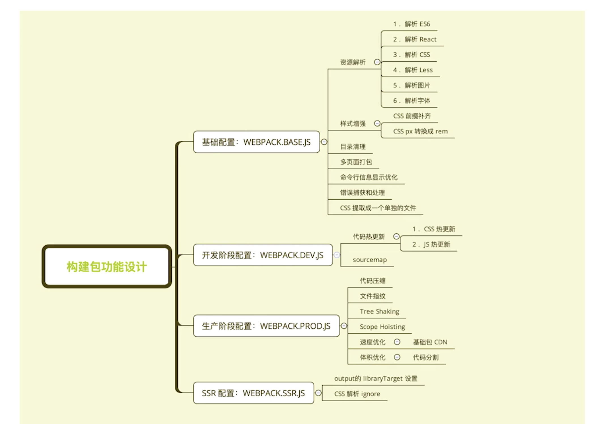
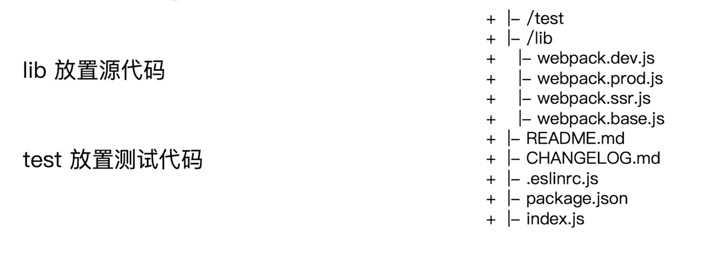
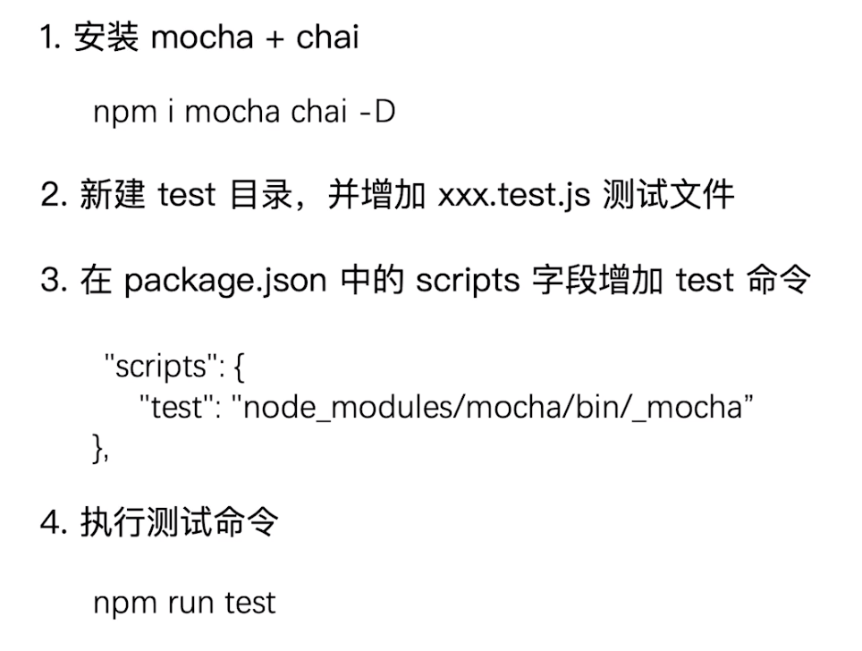
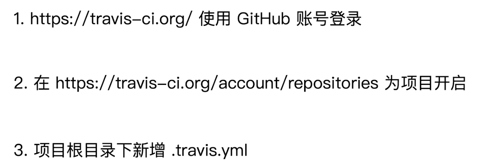
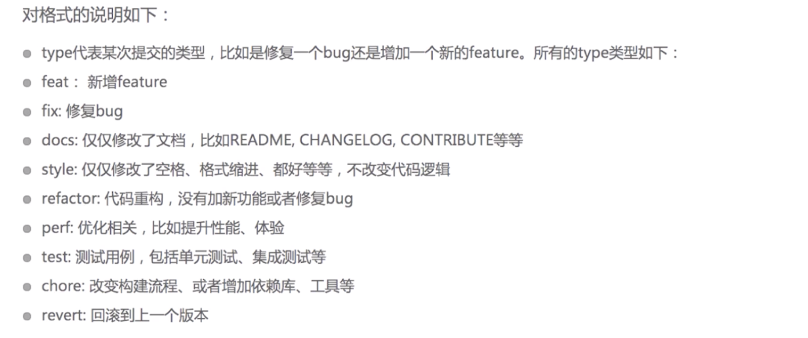

<!--
 * @Author: your name
 * @Date: 2020-03-16 21:38:15
 * @LastEditTime: 2020-03-24 23:29:27
 * @LastEditors: Please set LastEditors
 * @Description: In User Settings Edit
 * @FilePath: /webpack/02_demo/README.md
 -->
## 构建配置

### 构建配置抽离成npm包的意义

#### 通用性
+ 业务开发者无需关注构建配置
+ 统一团队构建脚本

#### 可维护性
+ 构建配置合理的拆分
+ README文档，ChangeLog文档

#### 质量
+ 冒烟测试，单元测试，测试覆盖率
+ 持续集成

### 构建配置管理的可选方案
+ 通过配置多个文件管理不同环境的构建，webpack --config 参数进行控制
+ 将构建配置设计成一个库，比如hjs-webpack,webpack-blocks
+ 抽成一个工具进行管理，比如：create-react-app
+ 将所有的配置放在一个文件，通过 --env 参数控制分支选择

### 构建配置包设计
#### 通过多个配置文件管理不同环境的webpack配置
+ 基础配置：webpack.base.js
+ 开发环境：webpack.dev.js
+ 生产环境：webpack.prod.js
+ ssr环境：webpack.ssr.js

#### 抽离成一个npm包统一管理
+ 规范：git commit 日志，README,ESlint规范
+ 质量：冒烟测试，单元测试，测试覆盖率和ci

### 通过webpack-merge组合配置
+ 合并配置：
```js
    const merge = require('webpack-merge');
    module.exports = merge(baseConfig,devConfig)
```

## 功能模块设计


### 目录结构设计


### 使用eslint规范构建脚本
+ 使用 eslint-config-airbnb-base
+ eslint --fix 可以自动处理空格
```js
    module.exports = {
        "parser":"babel-eslint",
        "extends":"airbnb-base",
        "env":{
            "browser":true,
            "node":true
        }
    }
```
+ 安装
```
    npm i eslint eslint-plugin-import eslint-config-airbnb-base babel-eslint -D
```
+ 增加npm scripts
```
    "eslint": "eslint --fix"
```

### 冒烟测试


#### 冒烟测试执行
+ 构建是否成功
+ 每次构建完成build目录是否有内容输出
  - 是否有js css等静态资源文件
  - 是否有html文件

#### 判断是否构建成功
+ 在项目里面运行构建，看看是否有报错

#### 判断基本功能是否正常
+ 编写mocha 测试用例
  - 是否有js css等静态资源文件
  - 是否有html文件

#### 实际测试
+ 创建test/smoke/index.js
+ 创建test/template
+ 把项目迁移到template下
+ 安装rimraf:用于删除dist目录
```
    npm i rimraf -D
```

+ 在test/smoke创建html-test.js 和 css-js-test.js
+ 安装mocha
```
     npm i mocha -D
```
+ 安装glob-all
```
    npm i glob-all -D
```
+ 编写html测试用例
```js
    // html-test.js
    const glob = require('glob-all')
    describe('checking generated in html file',() => {
        it('should generate html file',done => {
            const files = glob.sync([
                './dist/index.html',
                './dist/search.html'
            ])

            if(files.length >0){
                done()
            }else{
                throw new Error('no html files')
            }
        } )
    })
``` 
+ 编写css js测试用例
```js
    const glob = require('glob-all')
    describe('checking generated in css js file',() => {
        it('should generate css js file',done => {
            const files = glob.sync([
                './dist/index_*.js',
                './dist/index_*.css',
                './dist/search_*.js',
                './dist/search_*.css'
            ])

            if(files.length >0){
                done()
            }else{
                throw new Error('no css js files')
            }
        } )
    })
```
+ 在index.js中引入
```js
     // index.js
    const path = require('path');
    const webpack = require('webpack')
    const rimraf = require('rimraf');
    const Mocha = require('mocha');

    const mocha = new Mocha({
        timeout: '1000ms',
    })

    process.chdir(path.join(__dirname,'template')) // 进入template
    // 删除dist
    rimraf('./dist',() => {
        const prodConfig = require('../../lib/webpack.prod.js')

        webpack(prodConfig,(err,stats) => {
            if(err){
                console.error(err)
                process.exit(2)
            }
            console.log(stats.toString({
                colors:true,
                modules:true,
                children:false,
                
            }))
            console.log('webpack build success,begin run')
            mocha.addFile(path.join(__dirname,'html-test.js'))
            mocha.addFile(path.join(__dirname,'css-js-test.js'))


            mocha.run()
        })
    })
```

+ 执行 node test/smoke/index.js可以看到测试正常


### 单元测试与测试覆盖率
+ 常见测试框架

+ 以mocha和chai为例


#### 单元测试接入


+ 创建src/index.js 和 src/unit/webpack-base-test.js

+ 安装assert
```
     npm i assert -D
```

+ 写测试用例
```js
    // webpack-base-test.js
    const assert = require('assert');

    describe('webpack.base.js test case',() => {
        const baseConfig = require('../../lib/webpack.base.js')
        console.log('baseConfig',baseConfig)
        it('entry',()=>{
            assert.equal(baseConfig.entry.index,'/Users/liangchaofei/Desktop/learn/webpack/webpack_learn/10_demo/build-webpack/test/smoke/template/src/index/index.js')
        })
    })
```
+ 引入测试用例
```js
    // index.js
    const path = require('path')
    process.chdir(path.join(__dirname,'smoke/template'))
    describe('build webpack test case',() => {
        require('./unit/webpack-base-test.js');
    })
```
+ 增加test scripts
```
    "test": "./node_modules/.bin/_mocha"
```
+ npm run test即可

#### 测试覆盖率
+ 安装istanbul
```
     npm i istanbul -D
```
+ 修改test scripts
```
    "test": "istanbul cover ./node_modules/.bin/_mocha"
```

### 持续集成
+ 优点：
  - 快速发现错误
  - 防止分支大幅偏离主干
+ 核心措施
  - 代码集成到主干之前，必须通过自动化测试。只要有一个测试用例失败，就不能集成

#### 接入Travis ci


#### 把项目接入travis ci
+ 在github上创建一个项目
+ git pull 到本地
+ 在travis ci网站上接入github项目: https://travis-ci.com/
+ 创建.travis.yml
```
    language: node_js

    sudo: false

    cache:
        apt: true
        directories:
            - node_modules

    node_js: stable

    instal:
        - npm install -D
        - cd ./test/smoke/template
        - npm install -D
        - cd ../../../

    scripts:
        - npm test
```
+ 使用git提交代码，在https://travis-ci.com/ 看下是否成功即可

### 发布到npm
+ npm login 登陆
+ 升级版本
  - npm version patch: 升级补丁版本号
  - npm version minor: 升级小版本号
  - npm version major: 升级大版本号
+ npm publish : 发布

### git commit规范


#### 本地开发阶段增加precommit钩子
+ 安装husky
```
 npm i husky -D
```
+ 通过commitmsg校验钩子信息
```
    "scripts":{
        "commitmsg": "validate-commit-msg",
        "changelog": "conventional-changelog -p angular -i CHANGELOG.md -s -r 0"
    },

    "devDependencies":{
        "validate-commit-msg":"^2.11.1",
        "conventional-changelog-cli":"^1.2.0",
        "husky":"^0.13.1"
    }
```