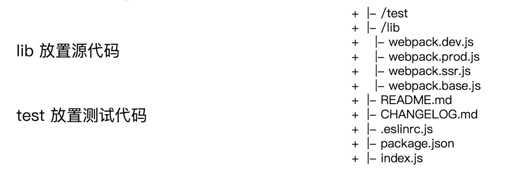

<!--
 * @Author: your name
 * @Date: 2020-03-16 21:38:15
 * @LastEditTime: 2020-03-24 14:42:28
 * @LastEditors: Please set LastEditors
 * @Description: In User Settings Edit
 * @FilePath: /webpack/02_demo/README.md
 -->
## 构建配置

### 构建配置抽离成npm包的意义

#### 通用性
+ 业务开发者无需关注构建配置
+ 统一团队构建脚本

#### 可维护性
+ 构建配置合理的拆分
+ README文档，ChangeLog文档

#### 质量
+ 冒烟测试，单元测试，测试覆盖率
+ 持续集成

### 构建配置管理的可选方案
+ 通过配置多个文件管理不同环境的构建，webpack --config 参数进行控制
+ 将构建配置设计成一个库，比如hjs-webpack,webpack-blocks
+ 抽成一个工具进行管理，比如：create-react-app
+ 将所有的配置放在一个文件，通过 --env 参数控制分支选择

### 构建配置包设计
#### 通过多个配置文件管理不同环境的webpack配置
+ 基础配置：webpack.base.js
+ 开发环境：webpack.dev.js
+ 生产环境：webpack.prod.js
+ ssr环境：webpack.ssr.js

#### 抽离成一个npm包统一管理
+ 规范：git commit 日志，README,ESlint规范
+ 质量：冒烟测试，单元测试，测试覆盖率和ci

### 通过webpack-merge组合配置
+ 合并配置：
```js
    const merge = require('webpack-merge');
    module.exports = merge(baseConfig,devConfig)
```

## 功能模块设计


### 目录结构设计


### 使用eslint规范构建脚本
+ 使用 eslint-config-airbnb-base
+ eslint --fix 可以自动处理空格
```js
    module.exports = {
        "parser":"babel-eslint",
        "extends":"airbnb-base",
        "env":{
            "browser":true,
            "node":true
        }
    }
```
+ 安装
```
    npm i eslint eslint-plugin-import eslint-config-airbnb-base babel-eslint -D
```
+ 增加npm scripts
```
    "eslint": "eslint --fix"
```

### 冒烟测试


#### 冒烟测试执行
+ 构建是否成功
+ 每次构建完成build目录是否有内容输出
  - 是否有js css等静态资源文件
  - 是否有html文件

#### 判断是否构建成功
+ 在项目里面运行构建，看看是否有报错

#### 判断基本功能是否正常
+ 编写mocha 测试用例
  - 是否有js css等静态资源文件
  - 是否有html文件

#### 实际测试
+ 创建test/smoke/index.js
+ 创建test/template